# TubeFocus - Comprehensive System Architecture Documentation

> **Version:** 1.0  
> **Last Updated:** January 2026  
> **Project Type:** AI-Powered Chrome Extension with Multi-Agent Backend

---

## Table of Contents

1. [Executive Summary](#1-executive-summary)
2. [High-Level System Architecture](#2-high-level-system-architecture)
3. [Frontend Architecture (Chrome Extension)](#3-frontend-architecture-chrome-extension)
4. [Backend Architecture (Flask API)](#4-backend-architecture-flask-api)
5. [AI Agents System](#5-ai-agents-system)
6. [Data Flow Diagrams](#6-data-flow-diagrams)
7. [Technology Stack & Justifications](#7-technology-stack--justifications)
8. [System Design Principles](#8-system-design-principles)
9. [Deployment Architecture](#9-deployment-architecture)
10. [Caching Strategy](#10-caching-strategy)
11. [CI/CD Pipeline](#11-cicd-pipeline)
12. [Security Architecture](#12-security-architecture)
13. [Implementation Status](#13-implementation-status)
14. [Future Roadmap](#14-future-roadmap)

---

## 1. Executive Summary

### 1.1 What is TubeFocus?

TubeFocus is an AI-powered productivity tool that helps users stay focused on their learning goals while browsing YouTube. It uses a multi-agent AI system to:

- **Score videos** for relevance to user's stated learning goals
- **Detect clickbait** and verify content quality
- **Monitor behavior** and provide proactive productivity nudges
- **Index watched content** for semantic search and recall

### 1.2 Problem Statement

```mermaid
flowchart LR
    subgraph Problem["❌ The Problem"]
        A[User opens YouTube] --> B[Starts with good intentions]
        B --> C[Gets distracted by recommendations]
        C --> D[Hours wasted on irrelevant content]
        D --> E[Learning goal not achieved]
    end
    
    subgraph Solution["✅ TubeFocus Solution"]
        F[User sets learning goal] --> G[AI scores every video]
        G --> H[Low scores trigger warnings]
        H --> I[Coach intervenes when distracted]
        I --> J[Goal achieved efficiently]
    end
    
    Problem -.->|TubeFocus| Solution
```



### 1.3 Key Metrics

| Metric | Description |
|--------|-------------|
| **Response Time** | < 2s for video scoring |
| **Accuracy** | AI-powered relevance scoring 0-100 |
| **Intervention Rate** | Proactive nudges when off-track |
| **Memory** | Semantic search over watched history |

---

## 2. High-Level System Architecture

### 2.1 Complete System Overview


### 2.2 Component Responsibilities

| Component | Responsibility | Technology |
|-----------|---------------|------------|
| Content Script | DOM manipulation, video detection | Vanilla JS |
| Background Worker | API communication, state management | Chrome APIs |
| Popup UI | User configuration, stats display | HTML/CSS/JS |
| Flask API | Request routing, orchestration | Python Flask |
| Gatekeeper | Quick relevance scoring | Gemini API |
| Auditor | Deep content verification | Gemini + Transcripts |
| Coach | Behavior monitoring | Gemini + Rules |
| Librarian | Semantic memory & search | ChromaDB |

---

## 3. Frontend Architecture (Chrome Extension)

### 3.1 Extension Component Architecture


### 3.2 Content Script Flow


### 3.3 Popup UI Structure


### 3.4 Design Decisions - Frontend

| Decision | Reasoning | Alternatives Considered |
|----------|-----------|------------------------|
| **Vanilla JS** | No build step, Chrome extension compatibility, small bundle | React, Vue (overkill for extension) |
| **Manifest V3** | Required for Chrome Web Store, modern service workers | V2 (deprecated) |
| **Local Storage** | Fast, synchronous, sufficient for session data | IndexedDB (complex), sync storage (quota limits) |
| **Single Content Script** | All YouTube pages need same functionality | Multiple scripts (unnecessary complexity) |
| **Background Service Worker** | API calls from extension context, handle CORS | Content script direct calls (blocked by CORS) |

---

## 4. Backend Architecture (Flask API)

### 4.1 API Endpoint Structure


### 4.2 Request Processing Flow


### 4.3 Module Dependencies


### 4.4 Error Handling Strategy


---

## 5. AI Agents System

### 5.1 Multi-Agent Architecture Overview


### 5.2 Gatekeeper Agent (Primary Scorer)


**Prompt Engineering:**
```
You are an expert productivity assistant helping a user decide 
if a YouTube video is worth watching based on their specific goal.

Video Title: {title}
Video Description: {description}
User's Goal: {goal}

Rate relevance 0-100. Consider:
- Does the video actually teach what is needed?
- Is the title clickbait?
- How aligned is the content with the goal?

Return JSON: {"score": <0-100>, "reasoning": "<explanation>"}
```

### 5.3 Auditor Agent (Content Verifier)


**Agentic Properties:**
- **Autonomous:** Fetches transcript independently
- **Stateful:** Maintains in-memory cache
- **Reasoning:** Multi-factor content analysis
- **Acting:** Returns actionable recommendation

### 5.4 Coach Agent (Behavior Monitor)


**Pattern Definitions:**

| Pattern | Condition | Intervention |
|---------|-----------|--------------|
| Doom Scrolling | avg_score < 40, videos > 5 | "Time to refocus?" |
| Rabbit Hole | Declining scores over time | "You're drifting from your goal" |
| Binge Watching | videos > 8 in session | "Take a break and apply learning" |
| Planning Paralysis | Only tutorials, no practice | "Ready to start building?" |
| On Track | avg_score > 70 | Positive reinforcement |

### 5.5 Librarian Agent (Memory & Search)


**Chunking Strategy:**
```python
def _chunk_transcript(transcript, chunk_size=500):
    """Split transcript into overlapping chunks."""
    words = transcript.split()
    overlap = 50  # words
    chunk_words = chunk_size // 5  # ~100 words per chunk
    
    for i in range(0, len(words), chunk_words - overlap):
        chunk = ' '.join(words[i:i + chunk_words])
        if len(chunk) > 50:
            chunks.append(chunk)
    return chunks
```

### 5.6 Why Not LangChain/LangGraph?


**Justification:**
- Our agents have **simple, well-defined responsibilities**
- No complex multi-step reasoning chains needed
- Direct API provides **2-3x faster response times**
- Easier to debug and optimize prompts
- Container size reduced by ~200MB

---

## 6. Data Flow Diagrams

### 6.1 Video Scoring Flow


### 6.2 Session Lifecycle Flow


### 6.3 Data Storage Flow


---

## 7. Technology Stack & Justifications

### 7.1 Complete Technology Stack


### 7.2 Technology Decision Matrix

| Category | Choice | Reasoning | Alternatives Rejected |
|----------|--------|-----------|----------------------|
| **Backend Framework** | Flask | Lightweight, simple routing, perfect for API-only service | Django (overkill), FastAPI (async not needed) |
| **LLM Provider** | Google Gemini 2.0 Flash | Fast, cost-effective, good JSON output | GPT-4 (expensive), Claude (no direct API access in region) |
| **Vector Database** | ChromaDB | Embedded, no external service needed, good for prototyping | Pinecone (external), Weaviate (complex) |
| **Caching** | Redis Cloud | Managed, fast, supports TTL | Memcached (less features), local cache only (not distributed) |
| **Container Runtime** | Google Cloud Run | Serverless, auto-scaling, pay-per-use | EC2 (always-on cost), Kubernetes (overkill) |
| **Python Version** | 3.11 | Performance improvements, latest stable | 3.9 (older), 3.12 (too new for some deps) |

### 7.3 SDK Migration: google-generativeai → google-genai

```mermaid
flowchart LR
    subgraph Old["❌ Deprecated SDK"]
        OLD_IMPORT[import google.generativeai as genai]
        OLD_CONFIG[genai.configure api_key]
        OLD_MODEL[genai.GenerativeModel]
        OLD_CALL[model.generate_content]
    end
    
    subgraph New["✅ New SDK"]
        NEW_IMPORT[from google import genai]
        NEW_CLIENT[genai.Client api_key]
        NEW_CALL[client.models.generate_content]
    end
    
    Old -->|Migration| New
```



**Migration Code Example:**
```python
# OLD (Deprecated)
import google.generativeai as genai
genai.configure(api_key=API_KEY)
model = genai.GenerativeModel('gemini-2.0-flash')
response = model.generate_content(prompt)

# NEW (Current)
from google import genai
client = genai.Client(api_key=API_KEY)
response = client.models.generate_content(
    model='gemini-2.0-flash',
    contents=prompt
)
```

---

## 8. System Design Principles

### 8.1 Architectural Principles Applied

```mermaid
flowchart TB
    subgraph Principles["Core Design Principles"]
        SRP[Single Responsibility]
        SEP[Separation of Concerns]
        LOOSE[Loose Coupling]
        FAIL[Graceful Degradation]
        CACHE[Cache-First Strategy]
    end
    
    subgraph Application["How Applied"]
        SRP --> |Each agent has one job| AGENTS[Agent Design]
        SEP --> |Frontend/Backend/Storage| LAYERS[Layer Separation]
        LOOSE --> |Message passing| COMMS[Component Communication]
        FAIL --> |Fallback scoring| FALLBACK[Error Handling]
        CACHE --> |Redis + in-memory| CACHING[Caching Strategy]
    end
```

### 8.2 Scalability Considerations

```mermaid
flowchart TB
    subgraph Current["Current Architecture (Single Instance)"]
        REQ1[Requests] --> API1[Flask Instance]
        API1 --> DB1[(Shared Storage)]
    end
    
    subgraph Scaled["Scaled Architecture (Multiple Instances)"]
        REQ2[Requests] --> LB[Load Balancer]
        LB --> API2A[Instance 1]
        LB --> API2B[Instance 2]
        LB --> API2C[Instance N]
        API2A --> DB2[(Redis)]
        API2B --> DB2
        API2C --> DB2
    end
    
    Current -->|Cloud Run Auto-scaling| Scaled
```

**Scaling Strategy:**

| Component | Scaling Approach |
|-----------|------------------|
| API Server | Cloud Run auto-scales 0-10 instances |
| Redis Cache | Redis Cloud handles scaling |
| ChromaDB | Currently single-instance (limitation) |
| Gemini API | Rate-limited by Google |

### 8.3 Fault Tolerance

```mermaid
flowchart TB
    subgraph NormalFlow["Normal Flow"]
        A[Request] --> B[Cache Check]
        B -->|Hit| C[Return Cached]
        B -->|Miss| D[API Call]
        D --> E[Cache Result]
        E --> F[Return]
    end
    
    subgraph FailureFlow["Failure Handling"]
        D -->|API Fails| G{Retry?}
        G -->|Retry 1| D
        G -->|Max Retries| H[Return Default Score]
        
        B -->|Redis Down| I[Skip Cache]
        I --> D
    end
    
    subgraph Fallbacks["Fallback Strategies"]
        J[Gemini Unavailable] --> K[Rule-based Scoring]
        L[Transcript Unavailable] --> M[Title-only Analysis]
        N[ChromaDB Error] --> O[Disable Librarian]
    end
```

---

## 9. Deployment Architecture

### 9.1 Google Cloud Run Deployment

```mermaid
flowchart TB
    subgraph Development["Development Environment"]
        LOCAL[Local Machine]
        VENV[Python venv]
        DOT_ENV[.env file]
    end
    
    subgraph CI_CD["CI/CD Pipeline"]
        GH[GitHub Repository]
        GHA[GitHub Actions]
        CB[Cloud Build]
    end
    
    subgraph Production["Production (Cloud Run)"]
        LB[Cloud Load Balancer]
        subgraph Instances["Auto-scaled Instances"]
            I1[Container 1]
            I2[Container 2]
            IN[Container N]
        end
        
        SM[Secret Manager]
    end
    
    subgraph External["External Services"]
        RD[(Redis Cloud)]
        GEM[Gemini API]
        YT[YouTube API]
    end
    
    LOCAL -->|git push| GH
    GH -->|trigger| GHA
    GHA -->|deploy| CB
    CB -->|build & push| Instances
    SM -->|inject secrets| Instances
    Instances <--> External
```

### 9.2 Container Configuration

```dockerfile
# Dockerfile
FROM python:3.11-slim

WORKDIR /app

# Install system dependencies
RUN apt-get update && apt-get install -y gcc g++

# Install Python dependencies
COPY requirements.txt .
RUN pip install --no-cache-dir -r requirements.txt

# Copy application code
COPY . .

# Create non-root user
RUN useradd --create-home app
USER app

EXPOSE 8080

# Health check
HEALTHCHECK --interval=30s --timeout=10s \
    CMD curl -f http://localhost:8080/health || exit 1

# Run with gunicorn
CMD ["gunicorn", "--bind", "0.0.0.0:8080", "api:app"]
```

### 9.3 Environment Variables

```mermaid
flowchart LR
    subgraph Required["Required Variables"]
        YT_KEY[YOUTUBE_API_KEY]
        GOOGLE_KEY[GOOGLE_API_KEY]
    end
    
    subgraph Optional["Optional Variables"]
        API_KEY[API_KEY]
        REDIS_HOST[REDIS_HOST]
        REDIS_PASS[REDIS_PASSWORD]
        DEBUG[DEBUG]
        PORT[PORT]
    end
    
    subgraph Sources["Configuration Sources"]
        ENV[.env file - Local]
        SM[Secret Manager - Prod]
        CLI[Command Line]
    end
    
    Sources --> Required
    Sources --> Optional
```

### 9.4 Cloud Run Settings

| Setting | Value | Reasoning |
|---------|-------|-----------|
| Memory | 2 GiB | ChromaDB + Model loading |
| CPU | 2 vCPU | Parallel API calls |
| Max Instances | 5 | Cost control |
| Min Instances | 0 | Scale to zero |
| Timeout | 300s | Long AI generation |
| Concurrency | 80 | Default |

---

## 10. Caching Strategy

### 10.1 Multi-Layer Caching Architecture

```mermaid
flowchart TB
    subgraph L1["L1: In-Memory Cache (Agent Level)"]
        AUDITOR_CACHE[Auditor Analysis Cache]
        COACH_CACHE[Coach Session State]
    end
    
    subgraph L2["L2: Redis Cache (Distributed)"]
        VIDEO_CACHE[Video Details - 24h TTL]
        CATEGORY_CACHE[Category Names - 24h TTL]
    end
    
    subgraph L3["L3: Persistent Storage"]
        CHROMA[ChromaDB - Transcript Vectors]
    end
    
    REQ[Request] --> L1
    L1 -->|Miss| L2
    L2 -->|Miss| API[External API]
    API --> L2
    L2 --> L1
    
    L1 -->|Eviction: LRU| L1
    L2 -->|Eviction: TTL| L2
```

### 10.2 Cache Key Strategy

```python
# Video Details Cache
cache_key = f"youtube:video_details:{video_id}"
# TTL: 24 hours

# Category Names Cache  
cache_key = f"youtube:category_name:{category_id}"
# TTL: 24 hours

# Auditor Analysis (In-Memory)
cache_key = f"{video_id}:{goal}"
# TTL: Session lifetime
```

### 10.3 Redis Configuration

```mermaid
flowchart LR
    subgraph RedisCloud["Redis Cloud Instance"]
        HOST[redis-12918.c212.ap-south-1-1.ec2.redns.redis-cloud.com]
        PORT[Port: 12918]
        AUTH[Username + Password Auth]
        TLS[TLS Encryption]
    end
    
    subgraph Operations["Supported Operations"]
        GET[GET - Fetch cached data]
        SETEX[SETEX - Store with TTL]
        PING[PING - Health check]
    end
    
    API[Flask API] --> RedisCloud
    RedisCloud --> Operations
```

**Note:** Redis is currently **disabled** in local development due to connection issues. Enable for production deployment.

---

## 11. CI/CD Pipeline

### 11.1 Current Pipeline (Manual)

```mermaid
flowchart LR
    subgraph Local["Local Development"]
        CODE[Write Code]
        TEST[Manual Testing]
        COMMIT[Git Commit]
    end
    
    subgraph Deploy["Deployment"]
        PUSH[Git Push]
        SCRIPT[Run deploy_to_cloud_run.sh]
        BUILD[Cloud Build]
        DEPLOY[Deploy to Cloud Run]
    end
    
    Local --> Deploy
```

### 11.2 Recommended Pipeline (Automated)

```mermaid
flowchart TB
    subgraph Trigger["Triggers"]
        PR[Pull Request]
        MERGE[Merge to Main]
        TAG[Release Tag]
    end
    
    subgraph CI["Continuous Integration"]
        LINT[Lint Python Code]
        UNIT[Unit Tests]
        INT[Integration Tests]
        SEC[Security Scan]
    end
    
    subgraph CD["Continuous Deployment"]
        BUILD[Build Docker Image]
        PUSH[Push to Container Registry]
        DEPLOY_STG[Deploy to Staging]
        SMOKE[Smoke Tests]
        DEPLOY_PROD[Deploy to Production]
    end
    
    Trigger --> CI
    CI -->|All Pass| CD
    CI -->|Fail| NOTIFY[Notify Developer]
    
    DEPLOY_STG --> SMOKE
    SMOKE -->|Pass| DEPLOY_PROD
    SMOKE -->|Fail| ROLLBACK[Rollback]
```

### 11.3 GitHub Actions Workflow (Recommended)

```yaml
# .github/workflows/deploy.yml
name: Deploy to Cloud Run

on:
  push:
    branches: [main]

jobs:
  deploy:
    runs-on: ubuntu-latest
    steps:
      - uses: actions/checkout@v3
      
      - name: Setup Python
        uses: actions/setup-python@v4
        with:
          python-version: '3.11'
      
      - name: Install dependencies
        run: pip install -r requirements.txt
      
      - name: Run tests
        run: pytest tests/
      
      - name: Auth to GCP
        uses: google-github-actions/auth@v1
        with:
          credentials_json: ${{ secrets.GCP_SA_KEY }}
      
      - name: Deploy to Cloud Run
        uses: google-github-actions/deploy-cloudrun@v1
        with:
          service: yt-scorer-api
          source: .
          region: us-central1
```

---

## 12. Security Architecture

### 12.1 Security Layers

```mermaid
flowchart TB
    subgraph Client["Client Security"]
        CORS[CORS Restrictions]
        HTTPS[HTTPS Only]
    end
    
    subgraph API["API Security"]
        KEY[API Key Validation]
        RATE[Rate Limiting - TODO]
        INPUT[Input Validation]
    end
    
    subgraph Infra["Infrastructure Security"]
        IAM[GCP IAM Roles]
        SM[Secret Manager]
        VPC[VPC - TODO]
    end
    
    subgraph Data["Data Security"]
        ENCRYPT[Encryption at Rest]
        TLS[TLS in Transit]
        MIN[Data Minimization]
    end
    
    Client --> API --> Infra --> Data
```

### 12.2 API Key Management

```mermaid
flowchart LR
    subgraph Development["Development"]
        DOT_ENV[.env file]
        GIT_IGNORE[.gitignore]
    end
    
    subgraph Production["Production"]
        SM[Secret Manager]
        ENV_VAR[Environment Variables]
    end
    
    DOT_ENV -->|Never commit| GIT_IGNORE
    SM -->|Inject at runtime| ENV_VAR
    ENV_VAR --> APP[Application]
```

### 12.3 Security Checklist

| Item | Status | Notes |
|------|--------|-------|
| HTTPS enforcement | ✅ Implemented | Cloud Run default |
| API key validation | ✅ Implemented | Basic validation |
| CORS configuration | ✅ Implemented | Allow Chrome extension |
| Secret management | ✅ Implemented | Secret Manager |
| Rate limiting | ⏳ TODO | Prevent abuse |
| Input sanitization | ✅ Implemented | Basic validation |
| SQL injection | N/A | No SQL database |
| Logging (no secrets) | ✅ Implemented | Sanitized logs |

---

## 13. Implementation Status

### 13.1 Feature Implementation Matrix

```mermaid
quadrantChart
    title Feature Implementation Status
    x-axis Low Effort --> High Effort
    y-axis Low Impact --> High Impact
    quadrant-1 Do Now
    quadrant-2 Plan Carefully
    quadrant-3 Delegate/Automate
    quadrant-4 Reconsider
    Video Scoring: [0.3, 0.9]
    Auditor Agent: [0.5, 0.7]
    Coach Agent: [0.6, 0.6]
    Librarian Agent: [0.7, 0.5]
    Rate Limiting: [0.2, 0.4]
    Analytics Dashboard: [0.8, 0.6]
    User Accounts: [0.9, 0.7]
    Mobile App: [0.95, 0.8]
```

### 13.2 Component Status Table

| Component | Status | Notes |
|-----------|--------|-------|
| **Chrome Extension** | ✅ Complete | Manifest V3, all UI elements |
| **Flask API** | ✅ Complete | All endpoints functional |
| **Gatekeeper Agent** | ✅ Complete | Primary scoring works |
| **Auditor Agent** | ✅ Complete | Transcript analysis works |
| **Coach Agent** | ✅ Complete | Pattern detection works |
| **Librarian Agent** | ✅ Complete | Semantic search works |
| **Redis Caching** | ⏸️ Disabled | Connection issues locally |
| **Cloud Deployment** | ⏳ In Progress | Needs billing setup |
| **CI/CD Pipeline** | ⏳ TODO | Manual deployment only |
| **Unit Tests** | ⏳ TODO | No test coverage |
| **Rate Limiting** | ⏳ TODO | Needed for production |
| **User Authentication** | ⏳ TODO | Currently anonymous |

### 13.3 Known Limitations

```mermaid
flowchart TB
    subgraph CurrentLimitations["Current Limitations"]
        L1[No user accounts - anonymous only]
        L2[ChromaDB not persistent on Cloud Run]
        L3[No rate limiting]
        L4[Single region deployment]
        L5[No analytics/monitoring]
        L6[Transcript not available for all videos]
    end
    
    subgraph Mitigations["Mitigations"]
        L1 -.->|Store goal in local storage| M1[Extension handles state]
        L2 -.->|Add Cloud Storage mount| M2[Persistent volume]
        L3 -.->|Add Flask-Limiter| M3[Rate limit middleware]
        L6 -.->|Fallback to title-only| M6[Light analysis]
    end
```

---

## 14. Future Roadmap

### 14.1 Planned Improvements

```mermaid
timeline
    title TubeFocus Roadmap
    
    section Phase 1 - Stability
        Q1 2026 : Enable Redis in production
               : Add comprehensive logging
               : Deploy to Cloud Run
               : Add rate limiting
    
    section Phase 2 - Features
        Q2 2026 : User accounts system
               : Sync across devices
               : Advanced analytics dashboard
               : Video recommendations
    
    section Phase 3 - Scale
        Q3 2026 : Multi-region deployment
               : Persistent Librarian storage
               : ML-based scoring improvements
               : Mobile app (React Native)
    
    section Phase 4 - Monetization
        Q4 2026 : Premium features
               : Team/Enterprise version
               : API access for third parties
```

### 14.2 Good-to-Have Features (Not Implemented)

```mermaid
flowchart TB
    subgraph Analytics["📊 Analytics & Insights"]
        A1[Daily/Weekly productivity reports]
        A2[Goal completion tracking]
        A3[Time spent per topic visualization]
        A4[Learning path suggestions]
    end
    
    subgraph Social["👥 Social Features"]
        S1[Share curated playlists]
        S2[Community goal templates]
        S3[Leaderboards optional]
    end
    
    subgraph AI["🤖 Advanced AI"]
        AI1[Fine-tuned scoring model]
        AI2[Personalized recommendations]
        AI3[Auto-generated study notes]
        AI4[Quiz generation from videos]
    end
    
    subgraph Integration["🔗 Integrations"]
        I1[Notion export]
        I2[Google Calendar blocks]
        I3[Obsidian sync]
        I4[Anki flashcard generation]
    end
```

### 14.3 Architecture Evolution

```mermaid
flowchart LR
    subgraph Current["Current: Monolith"]
        MONO[Single Flask App]
    end
    
    subgraph Future["Future: Microservices"]
        GW[API Gateway]
        SC[Scoring Service]
        AG[Agent Service]
        US[User Service]
        AN[Analytics Service]
    end
    
    Current -->|Scale demands| Future
    GW --> SC
    GW --> AG
    GW --> US
    GW --> AN
```

---

## Appendix A: File Structure

```
TubeFocus/
├── TubeFocus Extension/           # Chrome Extension
│   ├── manifest.json              # Extension manifest (V3)
│   ├── background.js              # Service worker
│   ├── content.js                 # YouTube page injection
│   ├── popup.html                 # Extension popup UI
│   ├── popup.js                   # Popup logic
│   ├── config.js                  # API configuration
│   ├── styles.css                 # UI styles
│   └── libs/
│       └── chart.min.js           # Chart.js for visualizations
│
├── YouTube Productivity Score Development Container/  # Backend
│   ├── api.py                     # Flask API server
│   ├── config.py                  # Configuration management
│   ├── youtube_client.py          # YouTube API client
│   ├── transcript_service.py      # Transcript extraction
│   ├── scoring_modules.py         # Detailed scoring
│   ├── simple_scoring.py          # Simple scoring
│   ├── auditor_agent.py           # Auditor agent
│   ├── coach_agent.py             # Coach agent
│   ├── librarian_agent.py         # Librarian agent
│   ├── data_manager.py            # Data persistence
│   ├── requirements.txt           # Python dependencies
│   ├── Dockerfile                 # Container definition
│   ├── deploy_to_cloud_run.sh     # Deployment script
│   └── .env                       # Environment variables (not committed)
│
└── Goalfinder/                    # Related project (reference)
```

---

## Appendix B: API Reference

### Endpoints Summary

| Method | Endpoint | Description | Auth |
|--------|----------|-------------|------|
| GET | `/health` | Health check | None |
| POST | `/score/simple` | Score video relevance | API Key |
| POST | `/score/fast` | Fast scoring (title only) | API Key |
| GET | `/transcript/{video_id}` | Get video transcript | API Key |
| POST | `/audit` | Deep content analysis | API Key |
| POST | `/coach/analyze` | Analyze session behavior | API Key |
| GET | `/coach/stats/{session_id}` | Get session stats | API Key |
| POST | `/librarian/index` | Index video for search | API Key |
| POST | `/librarian/search` | Semantic search | API Key |
| GET | `/librarian/stats` | Get indexing stats | API Key |

---

## Appendix C: Glossary

| Term | Definition |
|------|------------|
| **Gatekeeper** | Primary agent that scores video relevance |
| **Auditor** | Agent that verifies content quality and detects clickbait |
| **Coach** | Agent that monitors behavior and provides productivity nudges |
| **Librarian** | Agent that stores and retrieves watched video history |
| **Goal** | User-defined learning objective for the session |
| **Session** | Active period where TubeFocus is monitoring |
| **Score** | 0-100 relevance rating for a video |
| **TTL** | Time-To-Live for cached data |
| **ChromaDB** | Vector database for semantic search |
| **Embedding** | Numerical representation of text for similarity search |

---

*Document generated for TubeFocus v1.0 - AI-Powered YouTube Productivity Extension*
