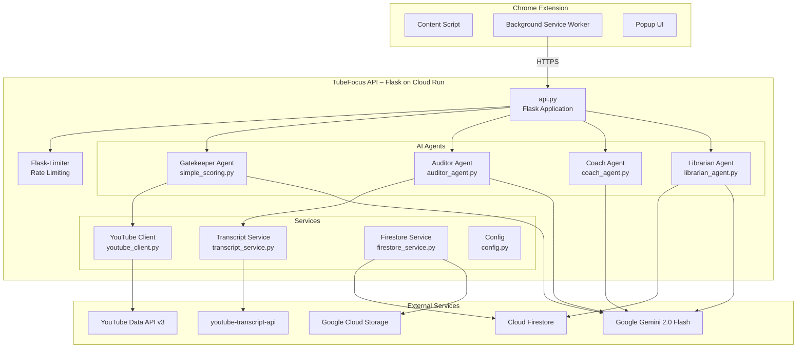
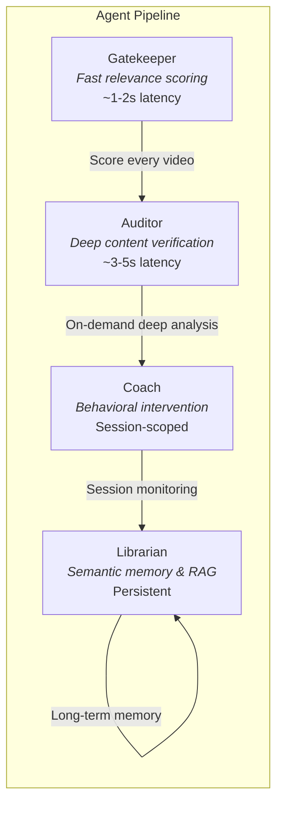
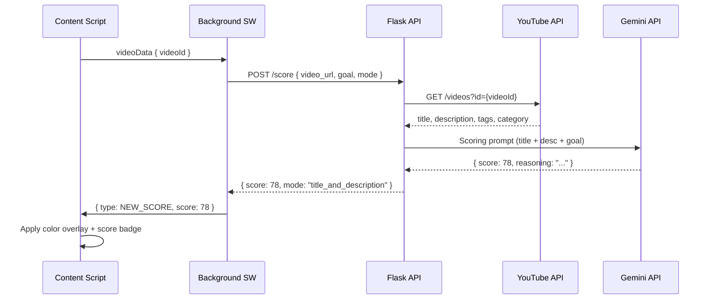

# TubeFocus Backend API

Flask-based REST API that powers the TubeFocus Chrome extension with AI-driven video relevance scoring, behavioral coaching, content auditing, and semantic search over viewing history.

Deployed on **Google Cloud Run** as a Docker container.

## Architecture



## Agent System

TubeFocus uses a multi-agent architecture where each agent has a distinct responsibility, latency profile, and data requirement.



### Gatekeeper Agent (`simple_scoring.py`)

The fast-path agent. Called on every video navigation during an active session.

- Fetches video metadata via YouTube Data API
- Sends title + description + optional transcript excerpt to Gemini 2.0 Flash
- Returns a 0-100 relevance score with reasoning
- Target latency: under 2 seconds

**Prompt strategy:** Structured JSON output with score and reasoning. Handles clickbait detection at a surface level by comparing title claims against description content.

### Auditor Agent (`auditor_agent.py`)

Deep content verification agent. Triggered on-demand when the user clicks "Deep Analyze."

- Fetches up to 3,000 characters of transcript via `youtube-transcript-api`
- Analyzes title vs. transcript alignment (clickbait detection)
- Measures information density (0-100)
- Determines if the video delivers on its title's promise
- Returns: clickbait score, density score, key topics, watch/skip/skim recommendation
- Falls back to title+description analysis when transcript is unavailable

**Caching:** In-memory cache keyed by `{video_id}:{goal}` to avoid redundant Gemini calls.

### Coach Agent (`coach_agent.py`)

Behavioral monitoring agent. Operates at the session level.

- Tracks score history, watch time, and video completion across a session
- Detects patterns: score decline, repeated distractions, extended sessions without breaks
- Generates contextual interventions based on coach mode:
  - **Strict:** Alerts after 1 off-topic video
  - **Balanced:** Allows up to 3, then nudges
  - **Relaxed:** Gentle reminders only
  - **Custom:** User-defined instruction following
- Break reminders after configurable intervals (default: 60 minutes)
- Intervention cooldown (2 minutes) to avoid notification spam
- "Back on track" encouragement when scores improve after a dip

**State:** In-memory session store. Sessions are ephemeral — cleared on session end or server restart.

### Librarian Agent (`librarian_agent.py`)

Persistent memory and semantic search agent.

- Indexes video transcripts into **Firestore** with vector embeddings
- Chunks transcripts into 500-character segments
- Generates embeddings via `text-embedding-004` model
- Supports **Firestore Vector Search** with cosine distance
- RAG chat: answers questions about previously watched content using retrieved context + Gemini

**Storage:** Firestore `video_chunks` collection with vector fields. Persistent across deployments.

## Request Flow



## API Endpoints

### Scoring

| Method | Endpoint | Description |
|--------|----------|-------------|
| `POST` | `/score` | Score a video's relevance to a learning goal |

**Request body:**
```json
{
  "video_url": "https://youtube.com/watch?v=abc123",
  "goal": "Learn React hooks",
  "mode": "title_and_description",
  "transcript": ""
}
```

**Modes:** `title_only`, `title_and_description`, `title_and_clean_desc`

### Auditor

| Method | Endpoint | Description |
|--------|----------|-------------|
| `POST` | `/audit` | Deep content analysis with clickbait detection |

**Request body:**
```json
{
  "video_id": "abc123",
  "title": "Learn React in 10 Minutes",
  "description": "...",
  "goal": "Master React hooks",
  "transcript": null
}
```

**Response includes:** `clickbait_score`, `density_score`, `delivers_promise`, `key_topics`, `recommendation` (watch/skip/skim), `relevance_to_goal`

### Coach

| Method | Endpoint | Description |
|--------|----------|-------------|
| `POST` | `/coach/analyze` | Analyze session behavior and generate interventions |

**Request body:**
```json
{
  "session_id": "session_1706886400000",
  "goal": "Learn React hooks",
  "session_data": [
    { "video_id": "abc", "title": "React Hooks", "score": 85, "timestamp": "..." }
  ]
}
```

### Librarian

| Method | Endpoint | Description |
|--------|----------|-------------|
| `POST` | `/librarian/index` | Index a video transcript for semantic search |
| `POST` | `/librarian/search` | Semantic search over viewing history |
| `POST` | `/librarian/chat` | RAG chat over indexed content |
| `GET`  | `/librarian/stats` | Get index statistics |
| `GET`  | `/librarian/get_highlights` | Retrieve all highlights |
| `GET`  | `/librarian/video/<id>` | Get a specific indexed video |

### Highlights (Firestore)

| Method | Endpoint | Description |
|--------|----------|-------------|
| `POST` | `/highlights` | Save a timestamp highlight |
| `GET`  | `/highlights` | List all highlights |
| `GET`  | `/highlights/video/<id>` | Highlights for a specific video |
| `DELETE` | `/highlights/<id>` | Delete a highlight |

### Operations

| Method | Endpoint | Description |
|--------|----------|-------------|
| `GET`  | `/health` | Health check with dependency status |
| `POST` | `/backup/chromadb` | Backup data to GCS |
| `POST` | `/restore/chromadb` | Restore data from GCS |

## Error Handling

All errors return a standardized JSON envelope:

```json
{
  "error": true,
  "error_code": 1001,
  "message": "Video not found or inaccessible",
  "details": {},
  "timestamp": "2026-01-15T10:30:00"
}
```

**Error code ranges:**

| Range | Category |
|-------|----------|
| 1001-1099 | Video errors (not found, private, deleted) |
| 1101-1199 | Data availability (missing title, description) |
| 1201-1299 | API configuration (missing keys, quota exceeded) |
| 1301-1399 | Scoring errors (models not loaded, scoring failed) |
| 1401-1499 | Request validation (invalid goal, invalid API key) |
| 1501-1599 | System errors (internal error, service unavailable) |

## Tech Stack

| Component | Technology |
|-----------|-----------|
| Framework | Flask 2.3.2 |
| AI Model | Google Gemini 2.0 Flash |
| Embeddings | text-embedding-004 |
| Vector Search | Firestore Vector Search (cosine) |
| Persistent Storage | Cloud Firestore |
| Backup Storage | Google Cloud Storage |
| Transcripts | youtube-transcript-api |
| Video Metadata | YouTube Data API v3 |
| Rate Limiting | Flask-Limiter |
| Deployment | Google Cloud Run (Docker + Gunicorn) |
| Language | Python 3.11 |

## Project Structure

```
backend/
├── api.py                  # Flask application, all route handlers
├── config.py               # Centralized configuration management
├── simple_scoring.py       # Gatekeeper Agent - LLM-based scoring
├── scoring_modules.py      # Component-based scoring (title/desc/tags/category)
├── auditor_agent.py        # Auditor Agent - content verification
├── coach_agent.py          # Coach Agent - behavioral intervention
├── librarian_agent.py      # Librarian Agent - Firestore vector search + RAG
├── youtube_client.py       # YouTube Data API wrapper
├── transcript_service.py   # youtube-transcript-api wrapper
├── firestore_service.py    # Firestore + GCS backup/restore
├── data_manager.py         # Feedback data management
├── Dockerfile              # Container definition
├── requirements.txt        # Python dependencies
├── .env.example            # Environment variable template
└── changelogs/             # Change history
```

## Setup

### Prerequisites

- Python 3.11+
- Google Cloud project with Firestore enabled
- YouTube Data API key
- Google Gemini API key

### Local Development

```bash
# Create and activate virtual environment
python3 -m venv venv
source venv/bin/activate

# Install dependencies
pip install -r requirements.txt

# Configure environment
cp .env.example .env
# Edit .env with your API keys

# Run locally
python api.py
```

The server starts on `http://localhost:8080`.

### Production Deployment (Cloud Run)

```bash
# Build and deploy
./deploy_to_cloud_run.sh

# Or manually
gcloud run deploy yt-scorer-api \
  --source . \
  --region us-central1 \
  --allow-unauthenticated
```

### Environment Variables

| Variable | Required | Description |
|----------|----------|-------------|
| `YOUTUBE_API_KEY` | Yes | YouTube Data API v3 key |
| `GOOGLE_API_KEY` | Yes | Google Gemini API key |
| `API_KEY` | Yes | API authentication key for extension requests |
| `PORT` | No | Server port (default: 8080) |
| `ENVIRONMENT` | No | `development` or `production` |
| `DEBUG` | No | Enable debug mode (default: false) |
| `RATELIMIT_DEFAULT` | No | Rate limit config (default: `200 per day;50 per hour`) |

### Health Check

```bash
curl https://your-cloud-run-url/health
```

Returns dependency status for YouTube API, Gemini API, and Firestore.
