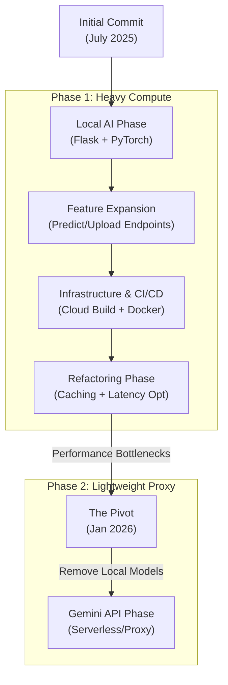

# Project Evolution & Architecture Flow

## Visual Timeline

## Detailed Git Frequency & Evolution

### Phase 1: The Foundation (July 2025)
*   **Commit**: `092ebb8` - *Initial commit: Add backend Flask app and Docker setup*
    *   **Goal**: Prove we can run a scoring server.
    *   **Tech**: Flask, Basic Dockerfile.
*   **Commit**: `2a443cb` - *feat: Modify backend to use local models*
    *   **Change**: Introduced `sentence-transformers`. The container grew to 3GB+.
*   **Commit**: `b193ef3` - *feat: Add /predict_title endpoint*
    *   **Evolution**: Refined scoring to be granular (Title vs Description).

### Phase 2: Infrastructure & Maturity (Late July - August 2025)
*   **Commit**: `0588dab` - *Add CI/CD configuration with Google Cloud Build*
    *   **Maturity**: Automated deployment to cloud registry.
*   **Commit**: `248cef0` - *feat: Refactor API structure and add local model caching*
    *   **Optimization**: Added Redis to combat the slow inference times of local models.
*   **Commit**: `3b67197` - *refactor: Rename API endpoints for clarity*
    *   **Cleanup**: Standardized API surface (`/score/detailed` vs `/score/simple`).

### Phase 3: The API Migration (Jan 2026)
*   **Commit**: `0414942` - *refactor(backend): migrate to gemini api, remove local models*
    *   **The Big Pivot**:
        *   **Deleted**: `download_models.py`, `simple_scoring_fast.py` (legacy optimized inference).
        *   **Added**: `google-generativeai` library.
        *   **Reason**: Move from CPU-bound local inference to I/O-bound API calls.
*   **Current State**:
    *   Backend acts as a security proxy.
    *   No heavy models in Docker image.
    *   Scoring logic moved to `simple_scoring.py` using Gemini 2.0 Flash.

## Architecture Comparison

| Feature | Old Architecture | New Architecture |
| :--- | :--- | :--- |
| **Model** | Local BERT/MiniLM | Gemini 2.0 Flash |
| **Compute** | CPU Heavy (Python/Torch) | Cloud API (Google) |
| **Storage** | 3GB+ Docker Image | ~500MB Docker Image |
| **Latency** | 200ms+ (Compute) | ~800ms (Network) |
| **Capability** | Similarity Score only | Score + Reasoning Text |

## File Evolution
*   `simple_scoring.py`: Completely rewritten.
    *   **Old**: Loaded `SentenceTransformer`, computed embeddings, cosine similarity.
    *   **New**: Constructs textual prompt, calls `genai.generate_content`, parses JSON.
*   `api.py`: Simplified.
    *   Removed `health_performance` endpoint (no longer relevant without local CPU load).
    *   Updated `simple_scoring` route to use new async-compatible logic.
